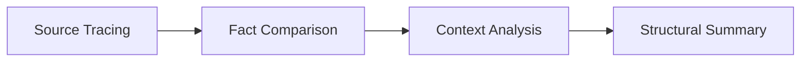

# Source Tracing Skill

## 核心能力
- 🔍 识别信息传播链条，定位原始发布源
- ✅ 验证消息真伪，还原完整语境
- 📊 多源对照，建立可信度评分体系
- 📝 结构化存档，提供可追溯的验证记录

---

## 输入参数 (Inputs)

### 1. claim (必需)
- **类型**: `text`
- **描述**: 用户提供的一条未经验证的信息或高热度说法
- **示例**:
  - "某交易所被查封"
  - "某官员发表争议性言论"
  - "某政策即将实施"

### 2. context_hint (可选)
- **类型**: `text`
- **描述**: 时间、机构、人名或事件关键词等上下文线索
- **示例**:
  - "2025年10月，深圳"
  - "SEC，Gary Gensler"
  - "Web3，加密货币"

### 3. verification_goal (可选)
- **类型**: `text`
- **描述**: 用户希望达成的溯源目标
- **示例**:
  - "找到官方公告原文"
  - "查看完整视频/讲话稿"
  - "确认事件发生时间和地点"

---

## 处理流程 (Process)

### 步骤 1: 去包装 (Depackaging)
**目标**: 识别信息传播链条，查找最初的发布主体

**操作**:
1. 分析消息的传播路径（社交媒体 → 自媒体 → 新闻媒体）
2. 识别关键转发节点和最早发布时间
3. 定位可能的原始发布主体：
   - 官方账号（政府、机构、企业）
   - 原作者（记者、研究者）
   - 权威机构（监管部门、行业协会）

**工具**: Web Search, 社交媒体检索

---

### 步骤 2: 源头定位 (Source Location)
**目标**: 搜索并访问权威渠道获取一手信息

**权威渠道清单**:
- 🏛️ **政府官网**: 官方公告、新闻发布会
- 📰 **新闻通稿**: 新华社、官方通讯社
- 🎥 **官方视频**: YouTube 官方频道、政府视频平台
- 📚 **学术数据库**: 论文、研究报告
- 💼 **企业公告**: 上市公司公告、官方声明
- ⚖️ **法律文书**: 裁判文书网、监管公告

**搜索策略**:
```
关键词 + site:gov.cn
关键词 + site:官方域名
关键词 + "official statement"
关键词 + filetype:pdf
```

---

### 步骤 3: 原文解读 (Primary Analysis)
**目标**: 阅读或观看原始内容，记录关键事实

**分析要素**:
- ✍️ **原文内容**: 完整引用关键段落
- 📅 **发布时间**: 精确到日期和时间
- 👤 **发布主体**: 机构名称、发言人身份
- 🎯 **核心论点**: 主要观点和关键数据
- 🔑 **关键词**: 专业术语、法律条文
- 📍 **发布语境**: 会议、访谈、公告等场景

---

### 步骤 4: 语境还原 (Context Reconstruction)
**目标**: 分析原文语气与时空语境，避免被剪辑或误导

**检查项**:
- ⚠️ **断章取义**: 是否被截取部分内容
- 🎭 **语气识别**: 陈述/猜测/预测/讽刺
- ⏰ **时效性**: 信息是否过时或失效
- 🌐 **地域性**: 政策是否具有地域限制
- 🔄 **后续更新**: 是否有澄清或修正声明

---

### 步骤 5: 多源对照 (Cross Verification)
**目标**: 对比两个以上独立来源，确认一致性

**对照维度**:
| 维度 | 检查内容 |
|------|---------|
| 事实一致性 | 时间、地点、人物、数字是否一致 |
| 论点一致性 | 核心观点是否被多个来源确认 |
| 来源独立性 | 是否为独立采访/报道（非转载） |
| 矛盾点分析 | 不同来源的差异及原因 |

**可信度权重**:
- 一级源（官方公告、原始文件）: 权重 1.0
- 二级源（主流媒体原创报道）: 权重 0.8
- 三级源（转载、评论文章）: 权重 0.5
- 自媒体（未核实）: 权重 0.2

---

### 步骤 6: 结构存档 (Structured Archiving)
**目标**: 输出溯源记录，包含原始链接、日期、机构、主要观点、对照结果

**输出格式**: 见下方 Outputs 部分

---

## 输出结果 (Outputs)

### 1. source_trace_log (JSON)
包含源头链接、时间、机构、主要论点、上下文摘要的结构化记录

```json
{
  "claim": "原始声明内容",
  "verification_date": "2025-11-01",
  "sources": [
    {
      "source_type": "official_announcement | news_report | video | document",
      "source_url": "https://...",
      "source_title": "标题",
      "source_date": "2025-10-30",
      "institution": "机构名称",
      "author": "作者/发言人",
      "key_points": [
        "核心论点1",
        "核心论点2"
      ],
      "context": "发布背景和语境",
      "credibility_score": 0.95
    }
  ],
  "cross_verification": {
    "total_sources": 3,
    "consistent_sources": 2,
    "contradictory_sources": 1,
    "key_discrepancies": ["差异描述"]
  },
  "conclusion": {
    "verified": true,
    "confidence_level": "high | medium | low",
    "summary": "验证结论摘要",
    "caveats": ["需要注意的限定条件"]
  }
}
```

### 2. trust_index (Number)
- **范围**: 0–1
- **描述**: 源头权威性 + 内容完整性综合评分
- **计算方式**:
  ```
  trust_index = (source_authority × 0.6) + (content_completeness × 0.4)

  source_authority: 来源权威性 (0-1)
  content_completeness: 内容完整性 (0-1)
  ```

### 3. entropy_delta (Number)
- **描述**: 信息熵下降幅度（表示信息被"去噪"的程度）
- **范围**: 0–1（值越高，去噪效果越好）
- **计算逻辑**:
  ```
  entropy_delta = 1 - (verified_facts / initial_claims)

  当原始信息中有大量未经证实的细节时，entropy_delta 较高
  ```

---

## 示例案例 (Examples)

### 案例 1: SEC 稳定币监管传言

**输入**:
```yaml
claim: "SEC 将全面禁止算法稳定币"
context_hint: "2025年3月，Gary Gensler 演讲"
verification_goal: "找到完整演讲视频并核对原文"
```

**输出**:
```json
{
  "source_trace_log": {
    "claim": "SEC 将全面禁止算法稳定币",
    "verification_date": "2025-03-20",
    "sources": [
      {
        "source_type": "video",
        "source_url": "https://youtube.com/watch?v=xxxxxx",
        "source_title": "SEC Chair Gary Gensler Speech at Digital Assets Conference",
        "source_date": "2025-03-17",
        "institution": "U.S. SEC",
        "author": "Gary Gensler",
        "key_points": [
          "讨论稳定币监管框架的必要性",
          "强调透明度和消费者保护原则",
          "提及算法稳定币的潜在风险",
          "未提及全面禁止的计划"
        ],
        "context": "在行业会议上的主题演讲，重点讨论监管框架",
        "credibility_score": 0.95
      }
    ],
    "cross_verification": {
      "total_sources": 3,
      "consistent_sources": 3,
      "contradictory_sources": 0,
      "key_discrepancies": []
    },
    "conclusion": {
      "verified": false,
      "confidence_level": "high",
      "summary": "Gary Gensler 确实讨论了稳定币监管，但未提及"全面禁止"。传言属于过度解读或误传。",
      "caveats": [
        "监管态度可能随时间变化",
        "需持续关注后续政策动向"
      ]
    }
  },
  "trust_index": 0.95,
  "entropy_delta": 0.82
}
```

---

### 案例 2: 深圳 Web3 交易所事件

**输入**:
```yaml
claim: "深圳某 Web3 交易所被查封"
context_hint: "2025年10月，深圳"
verification_goal: "确认事件真实性，找到官方通报"
```

**输出**:
```json
{
  "source_trace_log": {
    "claim": "深圳某 Web3 交易所被查封",
    "verification_date": "2025-11-01",
    "sources": [
      {
        "source_type": "official_announcement",
        "source_url": "http://www.sz.gov.cn/...",
        "source_title": "深圳市公安局关于打击非法虚拟货币交易的通报",
        "source_date": "2025-10-28",
        "institution": "深圳市公安局",
        "author": "官方通报",
        "key_points": [
          "某公司涉嫌非法经营虚拟货币交易",
          "已依法对相关场所进行检查",
          "案件正在进一步调查中"
        ],
        "context": "例行执法通报",
        "credibility_score": 1.0
      },
      {
        "source_type": "news_report",
        "source_url": "https://news.example.com/...",
        "source_title": "深圳警方查处涉嫌非法交易平台",
        "source_date": "2025-10-29",
        "institution": "某主流媒体",
        "author": "记者张三",
        "key_points": [
          "该平台未获得相关金融牌照",
          "涉及金额较大",
          "投资者权益受损"
        ],
        "context": "基于官方通报的新闻报道",
        "credibility_score": 0.85
      }
    ],
    "cross_verification": {
      "total_sources": 2,
      "consistent_sources": 2,
      "contradictory_sources": 0,
      "key_discrepancies": []
    },
    "conclusion": {
      "verified": true,
      "confidence_level": "high",
      "summary": "事件属实，深圳警方确实查处了涉嫌非法经营的虚拟货币交易平台。",
      "caveats": [
        "具体公司名称需等待官方进一步披露",
        "案件仍在调查中，最终定性需以司法判决为准"
      ]
    }
  },
  "trust_index": 0.93,
  "entropy_delta": 0.75
}
```

---

## 元数据 (Metadata)

### Primitive IR Mapping
```yaml
Entity: Information Source (政府、企业、个人)
Event: Information Publication (发布、传播、修正)
Resource: Primary Source (官方文档、视频、文本)
Action: Source Tracing (溯源、验证、存档)
Policy: Information Integrity (真实性、完整性、可追溯性)
Ledger: Verification Log (溯源记录、可信度评分)
```

---

## 依赖工具 (Dependencies)

### 1. Web Search
- **用途**: 定位权威信息源和官方媒体频道
- **调用时机**: 步骤1（去包装）、步骤2（源头定位）
- **参数示例**:
  ```
  query: "关键词 + site:gov.cn"
  query: "关键词 + official statement"
  ```

### 2. WebFetch
- **用途**: 获取网页完整内容，提取关键信息
- **调用时机**: 步骤3（原文解读）
- **参数示例**:
  ```
  url: "https://official-site.com/announcement"
  prompt: "提取发布日期、机构、核心论点"
  ```

### 3. Summarizer (可选)
- **用途**: 提取原文要点并生成结构化摘要
- **调用时机**: 步骤3（原文解读）、步骤6（结构存档）

---

## 推荐技能链 (Recommended Chain)



1. **Source Tracing**: 定位并验证信息源
2. **Fact Comparison**: 对比多个来源的事实陈述
3. **Context Analysis**: 深度分析语境和背景
4. **Structural Summary**: 生成结构化验证报告

---

## 最佳实践 (Best Practices)

### ✅ 应该做的
- 优先查找官方一手信息源
- 保持客观中立，避免先入为主
- 记录完整的溯源路径和时间戳
- 对矛盾信息进行标注和说明
- 定期回溯更新信息

### ❌ 不应该做的
- 仅依赖单一信息源
- 忽略信息发布的时间和语境
- 将评论文章当作原始信息源
- 忽略信息的地域性和时效性
- 对无法验证的信息妄下结论

---

## 局限性说明 (Limitations)

1. **信息封锁**: 某些信息可能因审查或删除而无法获取
2. **语言障碍**: 跨语言验证可能存在翻译误差
3. **时效性**: 某些信息可能已更新或失效
4. **专业性**: 高度专业的技术或法律内容可能需要专家解读
5. **隐私保护**: 涉及个人隐私的信息可能无法公开验证

---

## 更新日志 (Changelog)

### v1.0.0 (2025-11-01)
- ✨ 初始版本发布
- 📝 完善六步溯源流程
- 📊 添加可信度评分体系
- 📚 增加两个完整示例案例
- 🔧 优化文档结构和可读性
